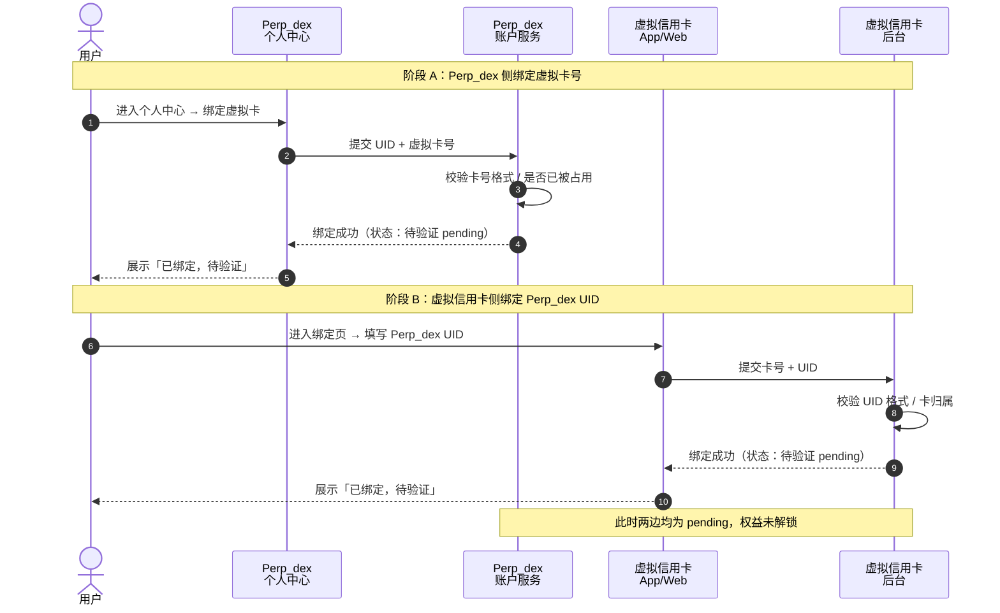
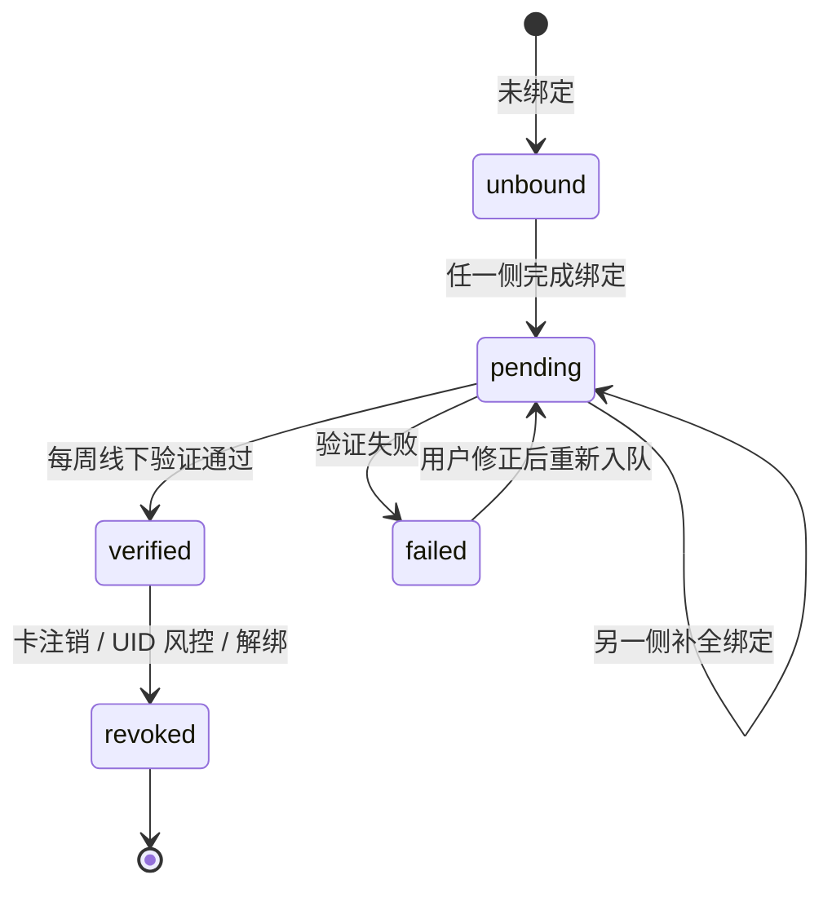
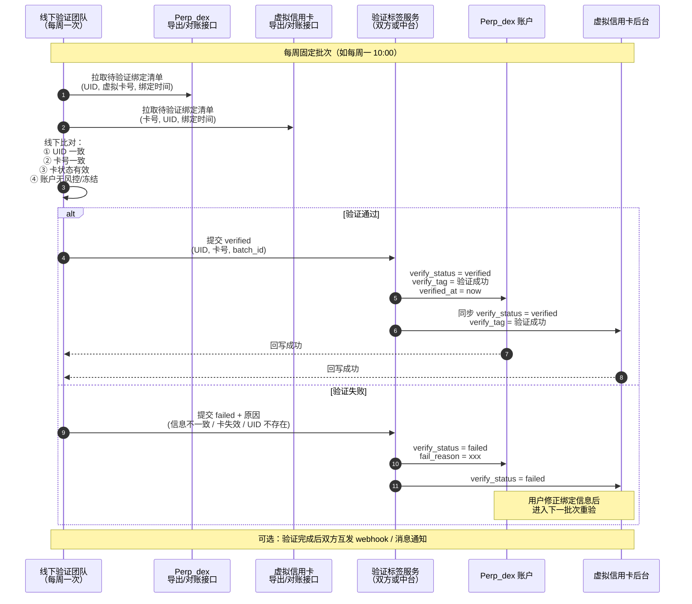
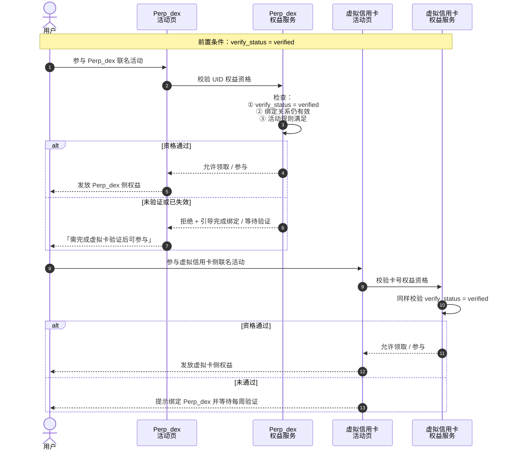
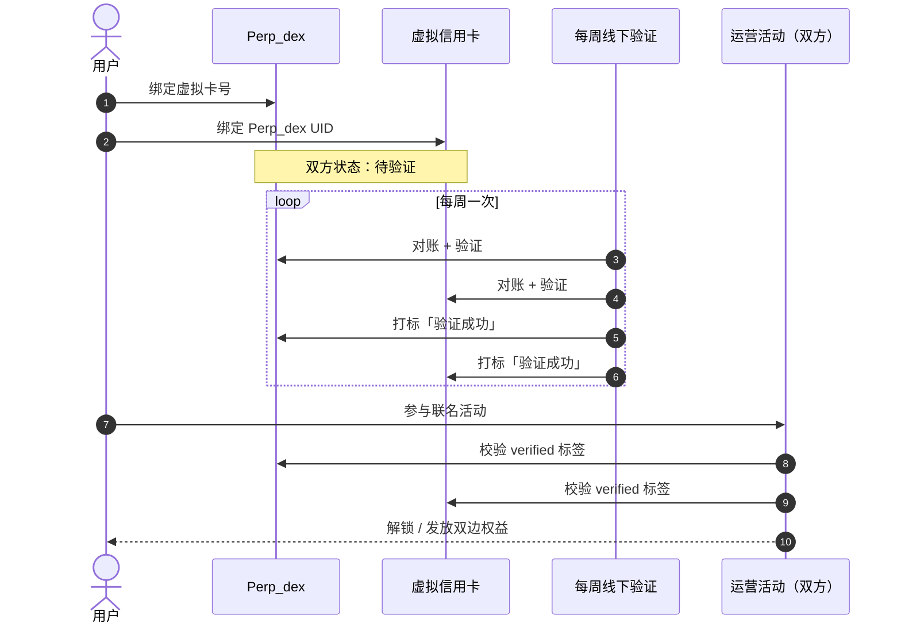

# ForX 和卡结合的方案

> 关联项目：**Perp_dex（ForX 永续合约）** ↔ **虚拟信用卡**  
> 目标：用户在两边完成绑定，经每周线下验证后打标「验证成功」，方可参与跨项目运营活动权益。

---

## 1. 背景与目标

| 项目 | 绑定能力 | 说明 |
|------|----------|------|
| **Perp_dex（ForX）** | 个人中心绑定虚拟卡号 | 用户以 ForX UID 为主体，关联一张虚拟信用卡 |
| **虚拟信用卡** | 绑定 Perp_dex UID | 用户以虚拟卡为主体，关联 ForX UID |

两边绑定信息需**定期（每周）线下验证**有效性，验证通过后双方同步标记 **「验证成功」** 标签。仅在该标签生效后，用户才可参与两边对应的**联名运营活动权益**。

---

## 2. 参与方

| 角色 | 说明 |
|------|------|
| **用户** | 在两个产品分别完成绑定 |
| **Perp_dex 个人中心** | 绑定虚拟卡号、展示验证状态 |
| **Perp_dex 账户服务** | 存储 UID ↔ 虚拟卡号映射 |
| **虚拟信用卡 App/Web** | 绑定 Perp_dex UID |
| **虚拟信用卡后台** | 存储卡号 ↔ UID 映射 |
| **线下验证团队** | 每周人工核对两边信息 |
| **验证标签服务** | 双方打标或中台统一同步状态 |
| **运营活动系统** | 校验验证标签后发放/解锁权益 |

---

## 3. 双向绑定（用户侧）

**设计要点：**

- 两边绑定可**任意顺序**，但均完成后才进入验证队列。
- 初始状态建议统一：`bind_status = bound`，`verify_status = pending`。
- 列表/详情展示：**已绑定 · 待验证**。

---

## 4. 验证状态机

---

## 5. 每周线下验证

### 5.1 验证标签字段（两边对齐）

| 字段 | 说明 |
|------|------|
| `verify_status` | `pending` / `verified` / `failed` / `revoked` |
| `verify_tag` | 展示用，如「验证成功」 |
| `verify_batch_id` | 批次号，如 `2026-W38` |
| `verified_at` | 验证通过时间 |
| `fail_reason` | 失败原因（仅 `failed` 时有值） |

### 5.2 验证失败原因（建议枚举）

| 原因 | 用户侧提示 |
|------|------------|
| UID 不一致 | 两边绑定的 UID 不匹配，请核对后重新绑定 |
| 卡号不一致 | 两边绑定的卡号不匹配 |
| 卡已注销/失效 | 虚拟卡状态异常，请更换有效卡 |
| UID 不存在/已冻结 | ForX 账户异常，请联系客服 |

---

## 6. 验证成功后解锁运营权益

**权益门禁规则：**

- `verify_status != verified` → **不可**参与任何跨项目联名活动。
- `verified` 但后续解绑 / 卡失效 → 权益**冻结**；已发放权益按活动规则回收或保留至过期。
- 两边活动可独立配置，但**共用同一验证标签**作为准入条件。

---

## 7. 端到端总览

---

## 8. 产品建议

### 8.1 绑定不对称时的 UX

只完成一侧绑定时，提示：

> 请在另一产品完成绑定。绑定完成后将进入每周验证队列，验证通过方可参与联名活动。

### 8.2 验证周期透明

个人中心 / 绑定页展示：

> 验证批次：每周一提交，预计 1–2 个工作日出结果。  
> 当前状态：待验证 / 验证成功 / 验证失败（附原因）

### 8.3 失败可自愈

用户修正绑定信息后，状态回到 `pending`，自动进入下一验证批次，无需额外人工开单。

### 8.4 权益与验证解耦

活动配置只认 `verified` + 活动自身规则（KYC、地区、时间窗等），避免活动逻辑与验证细节强耦合。

### 8.5 审计

每次线下验证保留：操作人、批次号、比对快照、通过/失败明细，便于客诉与合规追溯。

---

## 9. 后续可扩展

- 验证自动化：在规则明确后，由中台自动比对，线下仅处理异常单。
- 解绑流程：用户主动解绑 → `revoked`，双边权益同步失效。
- 活动联动配置表：活动 ID、所需 `verify_status`、Perp_dex 权益、虚拟卡权益、有效期。
