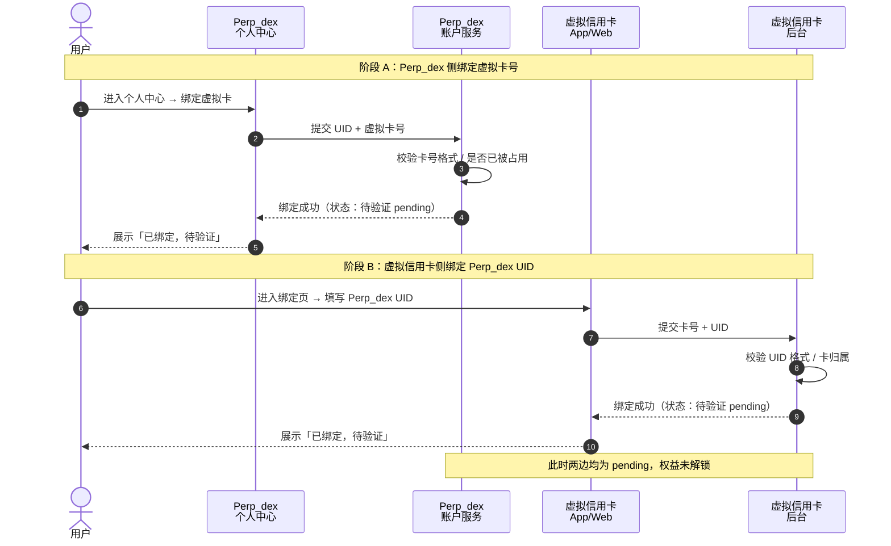
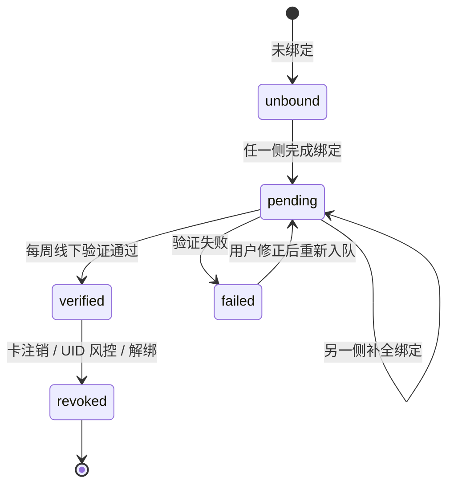
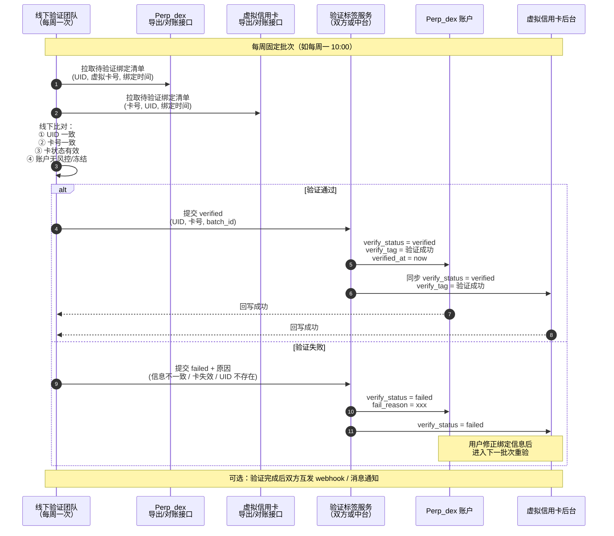
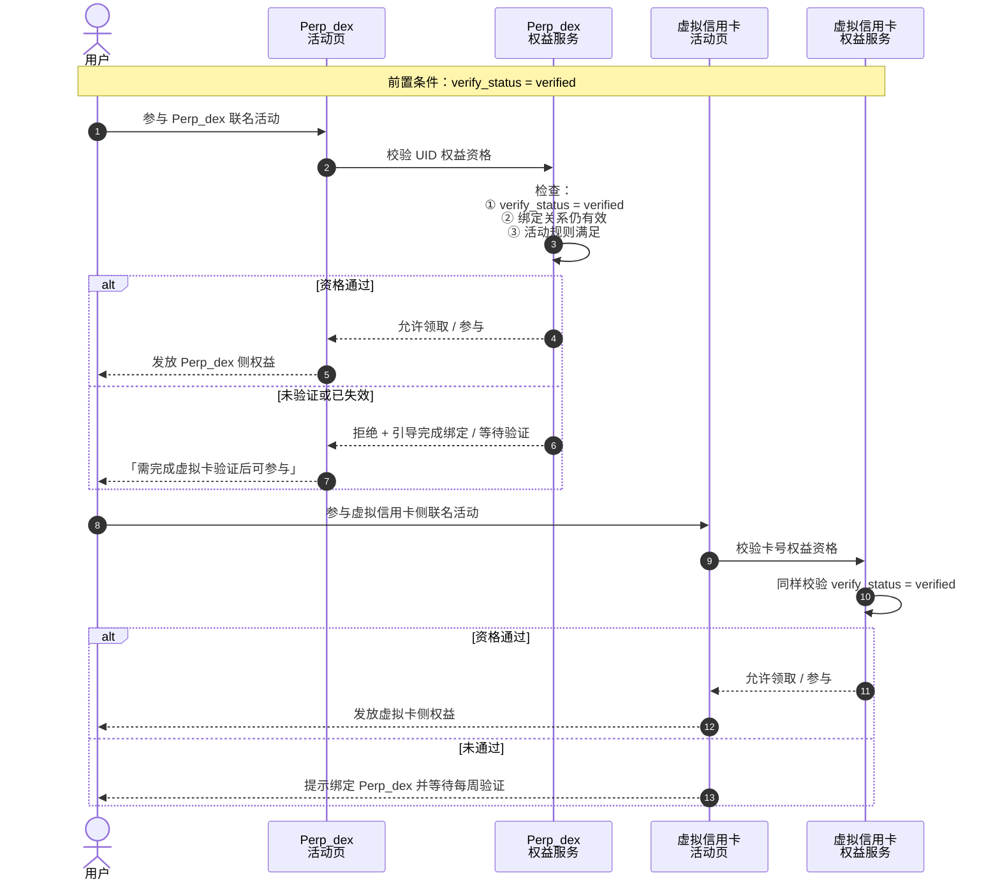
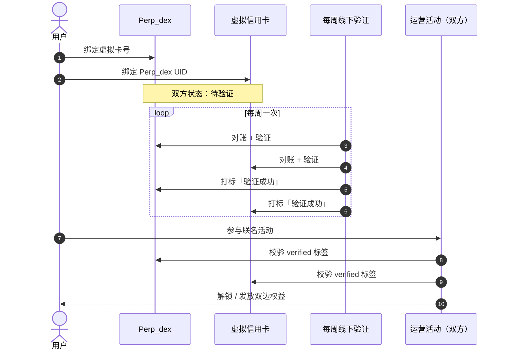
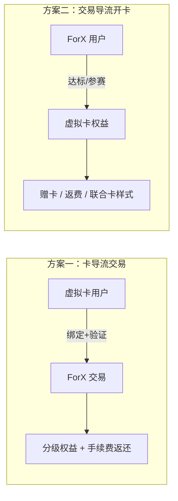
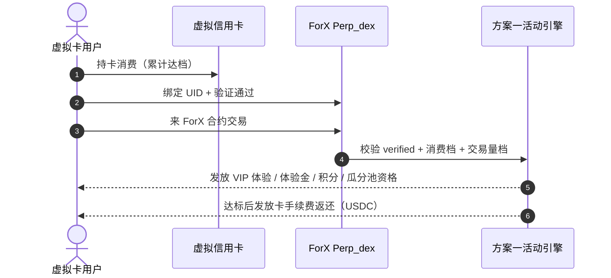
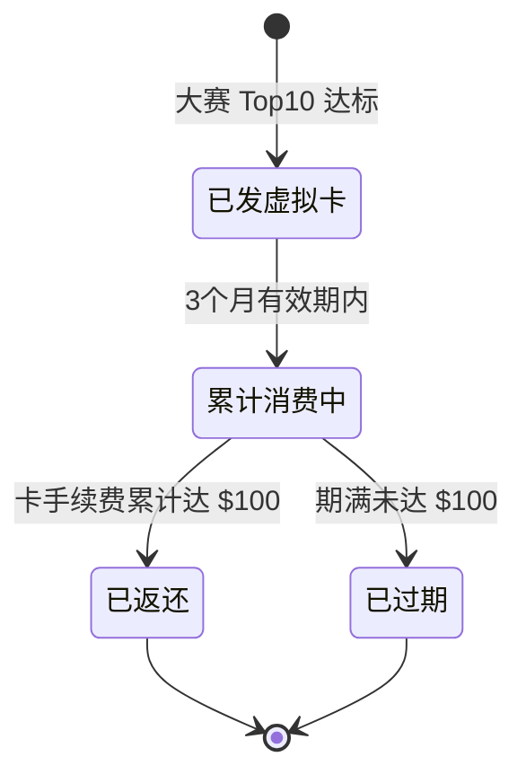

# ForX 和卡结合的方案

> 关联项目：**Perp_dex（ForX 永续合约）** ↔ **虚拟信用卡**  
> 目标：用户在两边完成绑定，经每周线下验证后打标「验证成功」，方可参与跨项目运营活动权益。

---

## 1. 背景与目标

| 项目 | 绑定能力 | 说明 |
|------|----------|------|
| **Perp_dex（ForX）** | 个人中心绑定虚拟卡号 | 用户以 ForX UID 为主体，关联一张虚拟信用卡 |
| **虚拟信用卡** | 绑定 Perp_dex UID | 用户以虚拟卡为主体，关联 ForX UID |

两边绑定信息需**定期（每周）线下验证**有效性，验证通过后双方同步标记 **「验证成功」** 标签。仅在该标签生效后，用户才可参与两边对应的**联名运营活动权益**。

---

## 2. 参与方

| 角色 | 说明 |
|------|------|
| **用户** | 在两个产品分别完成绑定 |
| **Perp_dex 个人中心** | 绑定虚拟卡号、展示验证状态 |
| **Perp_dex 账户服务** | 存储 UID ↔ 虚拟卡号映射 |
| **虚拟信用卡 App/Web** | 绑定 Perp_dex UID |
| **虚拟信用卡后台** | 存储卡号 ↔ UID 映射 |
| **线下验证团队** | 每周人工核对两边信息 |
| **验证标签服务** | 双方打标或中台统一同步状态 |
| **运营活动系统** | 校验验证标签后发放/解锁权益 |

---

## 3. 双向绑定（用户侧）

**设计要点：**

- 两边绑定可**任意顺序**，但均完成后才进入验证队列。
- 初始状态建议统一：`bind_status = bound`，`verify_status = pending`。
- 列表/详情展示：**已绑定 · 待验证**。

---

## 4. 验证状态机

---

## 5. 每周线下验证

### 5.1 验证标签字段（两边对齐）

| 字段 | 说明 |
|------|------|
| `verify_status` | `pending` / `verified` / `failed` / `revoked` |
| `verify_tag` | 展示用，如「验证成功」 |
| `verify_batch_id` | 批次号，如 `2026-W38` |
| `verified_at` | 验证通过时间 |
| `fail_reason` | 失败原因（仅 `failed` 时有值） |

### 5.2 验证失败原因（建议枚举）

| 原因 | 用户侧提示 |
|------|------------|
| UID 不一致 | 两边绑定的 UID 不匹配，请核对后重新绑定 |
| 卡号不一致 | 两边绑定的卡号不匹配 |
| 卡已注销/失效 | 虚拟卡状态异常，请更换有效卡 |
| UID 不存在/已冻结 | ForX 账户异常，请联系客服 |

---

## 6. 验证成功后解锁运营权益

**权益门禁规则：**

- `verify_status != verified` → **不可**参与任何跨项目联名活动。
- `verified` 但后续解绑 / 卡失效 → 权益**冻结**；已发放权益按活动规则回收或保留至过期。
- 两边活动可独立配置，但**共用同一验证标签**作为准入条件。

---

## 7. 端到端总览

---

## 8. 产品建议

### 8.1 绑定不对称时的 UX

只完成一侧绑定时，提示：

> 请在另一产品完成绑定。绑定完成后将进入每周验证队列，验证通过方可参与联名活动。

### 8.2 验证周期透明

个人中心 / 绑定页展示：

> 验证批次：每周一提交，预计 1–2 个工作日出结果。  
> 当前状态：待验证 / 验证成功 / 验证失败（附原因）

### 8.3 失败可自愈

用户修正绑定信息后，状态回到 `pending`，自动进入下一验证批次，无需额外人工开单。

### 8.4 权益与验证解耦

活动配置只认 `verified` + 活动自身规则（KYC、地区、时间窗等），避免活动逻辑与验证细节强耦合。

### 8.5 审计

每次线下验证保留：操作人、批次号、比对快照、通过/失败明细，便于客诉与合规追溯。

---

## 9. 后续可扩展

- 验证自动化：在规则明确后，由中台自动比对，线下仅处理异常单。
- 解绑流程：用户主动解绑 → `revoked`，双边权益同步失效。
- 活动联动配置表：活动 ID、所需 `verify_status`、Perp_dex 权益、虚拟卡权益、有效期。

---

## 10. 运营方案

> **独立模块**：与 §1–§9 的绑定 / 验证流程解耦描述，聚焦**验证通过后**可落地的两类运营方向。  
> **前置条件**：用户 `verify_status = verified`（见 §5–§6）。  
> **ROI**：本模块仅列出权益类型与规则框架，**ROI 后续再测算**。

### 10.1 方案总览

| 方案 | 方向 | 核心目标 |
|------|------|----------|
| **方案一** | 虚拟卡 → ForX | 吸引虚拟卡活跃用户来 Perp_dex 交易 |
| **方案二** | ForX → 虚拟卡 | 把虚拟卡当作 Perp_dex 拉新 / 促活抓手 |

---

### 10.2 方案一：吸引虚拟卡活跃用户来 Perp_dex 交易

**适用人群**：自虚拟卡渠道导流、已完成绑定且验证成功的 ForX 用户（含新注册与老用户回流，具体以活动配置为准）。

**分层依据**：虚拟卡侧累计消费金额（统计周期、是否含退款等细则待运营与卡方对齐）。

#### 10.2.1 消费分层权益（ForX 侧）

| 虚拟卡消费门槛 | ForX VIP 体验 | 交易体验金 | 积分加成 | 其他权益 | 即刻积分奖励 |
|----------------|---------------|------------|----------|----------|--------------|
| **来 ForX 交易即可**（基础档） | VIP 2 体验卡 | — | 限时 **1.2×** | — | **10** ForX 积分 |
| **$1,000+** | VIP 3 体验金卡 | **100 USDC** | 限时 **1.3×** | — | **20** ForX 积分 |
| **$5,000+** | VIP 3 体验金卡 | **500 USDC** | 限时 **1.4×** | 虚拟卡 **USDC 限时空投瓜分池** | **30** ForX 积分 |
| **$10,000+** | VIP 4 体验金卡 | **1,000 USDC** | 限时 **1.5×** | 虚拟卡 **USDC 限时空投瓜分池** | **50** ForX 积分 |

**权益类型说明（待产品细化）：**

| 权益类型 | 说明 |
|----------|------|
| **VIP 体验卡** | 限时享受对应 VIP 等级费率 / 权益，到期恢复用户原等级 |
| **交易体验金** | USDC 计价的合约体验金，按现有体验金规则使用 |
| **限时积分加成** | 在加成有效期内，ForX 积分获取按配置倍数结算 |
| **即刻 ForX 积分** | 达标后一次性发放至积分账户 |
| **USDC 限时空投瓜分池** | 符合条件的用户进入瓜分池，按规则分配虚拟卡侧 USDC 权益 |

> 高档位权益**包含**低档位同类权益的升级或替换关系，需在活动规则中明确是否叠加、是否取最高档。

#### 10.2.2 虚拟卡导流新用户 · 卡手续费返还（ForX 交易量阶梯）

**适用对象**：所有从虚拟卡渠道过来、在 ForX 产生合约交易的新用户（「新用户」定义与统计窗口待运营确认）。

**返还标的**：虚拟信用卡 **消费 / 卡手续费**（非 ForX 合约手续费）。

| ForX 累计交易额 | 卡手续费返还 |
|-----------------|--------------|
| **$10,000** | **10 USDC** |
| **$100,000** | **100 USDC** |
| **$1,000,000** | **1,000 USDC** |
| **$10,000,000** | **5,000 USDC** |

**规则要点（待细化）：**

- 交易额统计口径：合约成交名义价值 / 有效交易量（与现有 VIP、积分统计对齐）。
- 返还形式：返还至 ForX 账户 **USDC 余额** 或 **USDC 交易体验金**（二选一或按活动配置，与方案二返费策略保持一致）。
- 阶梯关系：建议**取最高达标档单次发放**，不重复累加各档（避免歧义，以最终 PRD 为准）。
- 与 §10.2.1 消费分层权益**可并行**，门禁均为 `verified` + 活动有效期。

---

### 10.3 方案二：把虚拟卡当作 Perp_dex 拉新 / 促活抓手

**方向**：以 ForX 侧用户行为（注册、入金、交易、赛事排名等）为触发条件，发放虚拟卡相关权益，提升拉新与活跃。

以下为**举例活动类型**，实际上线需单独配置活动 ID、库存、时间与合规审核。

#### 10.3.1 活动类型一：新用户赠卡

| 项 | 内容 |
|----|------|
| **活动名称（示例）** | 限时限量 · 注册入金交易赠虚拟卡 |
| **参与条件** | 限时内 **新注册** + **入金 ≥ 100 USDC** + **完成合约交易** |
| **权益** | 免费获得 **虚拟信用卡一张** |
| **限制** | 限时 + 限量（总名额 / 每日名额待配置） |
| **门禁** | 新用户身份 + 活动期内达标；开卡后走 §3–§5 绑定验证流程 |

#### 10.3.2 活动类型二：交易大赛 Top10 赠卡 + 返费

| 项 | 内容 |
|----|------|
| **活动名称（示例）** | 限时交易大赛 · Top10 联名权益 |
| **参与条件** | 参加限时 **合约交易大赛**，排名 **前 10 名** |
| **权益** | ① 免费获得 **虚拟信用卡一张** ② **$100 USDC** 的 **卡消费手续费返还** |
| **返费有效期** | **3 个月** |
| **返还触发** | 卡侧累计消费手续费达到 **$100** 时 **即刻返还**（满额触发，非按月） |
| **返还形式（二选一）** | **A.** 返还 **USDC** 至 ForX 账户余额 **B.** 返还 **USDC 交易体验金** 至 ForX 账户 |
| **备注** | 两种返还路径需在用户领券 / 开卡时择一或按活动默认；需在卡方与 ForX 对账 |

#### 10.3.3 活动类型三：ForX × 虚拟卡「联合卡」展示样式

| 项 | 内容 |
|----|------|
| **产品形态** | 虚拟信用卡 + Perp_dex **联合卡** — **卡片 UI / 品牌样式** 联合设计 |
| **底层能力** | 与标准虚拟卡 **相同**（发卡、清算、收费结构一致，无额外底层 SKU） |
| **差异点** | 卡面、App 内卡片详情页、ForX 个人中心联动展示等 **视觉与品牌联合** |
| **发放对象（示例）** | ForX **高贡献用户**（如 VIP 高等级 / 累计交易量达标）或 **交易赛排行靠前用户** |
| **运营价值** | 身份象征 + 促活激励，不增加发卡系统复杂度 |

**设计原则：**

- 「联合卡」= **同一虚拟卡产品 + 限定皮肤 / 标识**，避免双套计费与对账。
- 资格名单可由 ForX 导出 UID，卡方批量打标或发卡时写入联名标识。
- 联合卡用户参与方案一权益时，仍须满足 `verified` 与对应活动规则。

---

### 10.4 两方案对比与协同

| 维度 | 方案一（卡 → 交易） | 方案二（交易 → 卡） |
|------|---------------------|---------------------|
| **主目标** | 提升 ForX 交易与资产规模 | 拉新、促活、品牌联名 |
| **主激励** | VIP / 体验金 / 积分 / 返费 | 赠卡 / 返费 / 联合卡 |
| **关键指标（待 ROI）** | 导流注册率、交易量、留存 | 新注册、入金率、大赛参与、开卡数 |
| **与验证关系** | 均需 `verified` 后享跨端权益 | 开卡后仍需绑定验证方可享双边活动 |
| **返费一致性** | §10.2.2 交易量阶梯返卡费 | §10.3.2 大赛返卡费（形式 A/B 对齐） |

两方案**可同时在线**，但同一用户同一权益类型是否互斥（例如既拿方案一积分又拿方案二赠卡）需在活动配置表中声明优先级。

---

### 10.5 待后续补齐（ROI 与 PRD）

- [ ] 各档位权益成本与预期 LTV，ROI 测算模型
- [ ] 「虚拟卡消费 $X」统计周期、退款扣减、币种换算规则
- [ ] 「ForX 新用户」与「从虚拟卡导流」的判定口径（UTM / 绑定来源 / 首绑时间）
- [ ] 返 USDC 余额 vs 体验金的财务与风控策略
- [ ] 联合卡皮肤资源规范与发卡批量流程
- [ ] 活动配置表字段：`activity_id`、`scheme`（方案一/二）、`tier`、`benefit_types`、`mutex_group`
