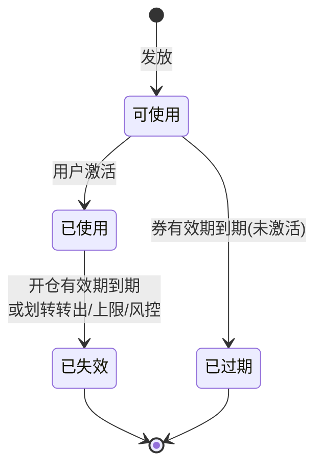
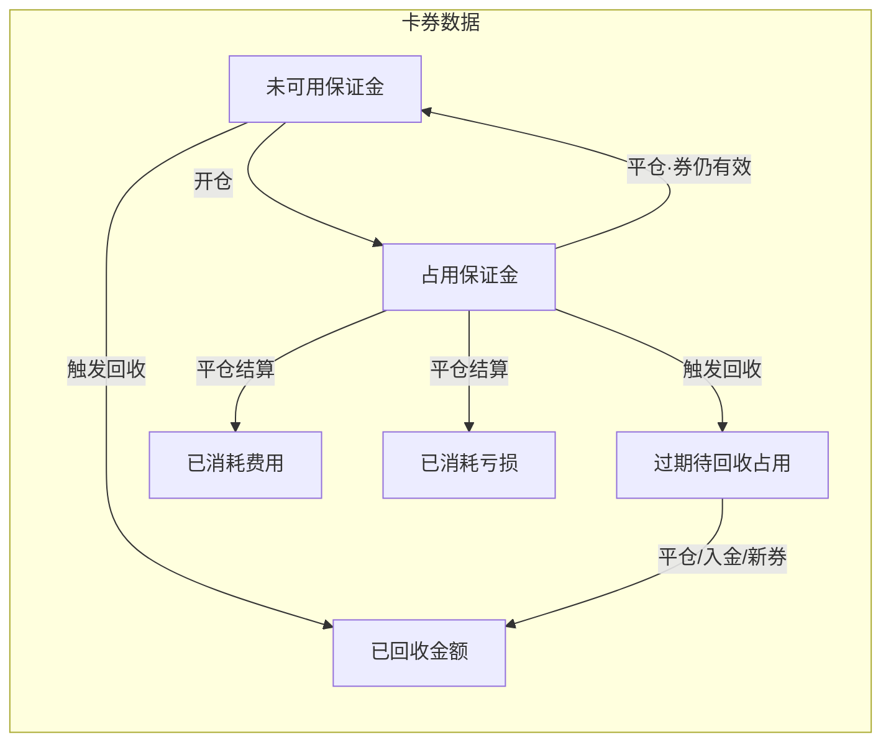
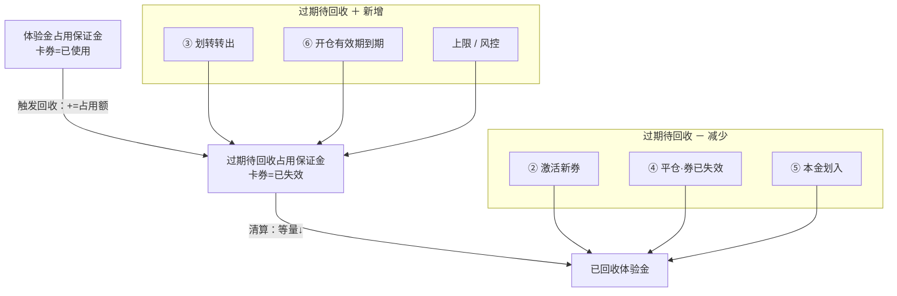
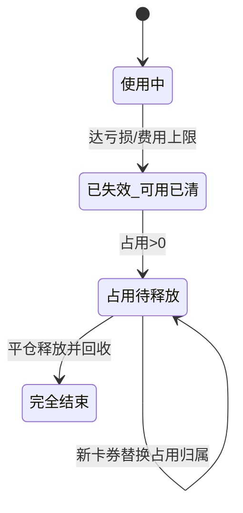

# 体验金回收机制改版方案（v2）

> **状态**：方案讨论稿 · 替代原《[合约体验金&卡券中心页](合约体验金&卡券中心页（后台_Web_APP）.md)》§6 中「减仓 / 抽离仓位保证金」回收路径  
> **流程图**：
> - 行为分支（Step × 卡券 × 数据 × **过期待回收**）：`perp_dex/流程图/体验金回收-行为分支.mmd`
> - **过期待回收关联（+/− 一眼看懂）**：`perp_dex/流程图/体验金回收-过期待回收关联.mmd`
> - 卡券状态路由：`perp_dex/流程图/体验金回收机制v2.mmd`

**术语（避免和「划转」混淆）：**

| 术语 | 方向 | 在 v2 里的角色 |
|------|------|----------------|
| **划转转出** | 交易账户 → 资金账户 | **触发回收**（§3.3）：未可用→已回收，占用→过期待回收 |
| **划转本金入合约** | 资金账户 → 交易账户 | **过期待回收清算**（§3.5） |
| **平仓** | 平/减仓 | 结算费用/亏损 + 释放过期待回收（§3.4） |
| **激活新卡券** | 卡券中心 | 替换占用 + 清算过期待回收（§3.2） |

---

## 1. 改版背景

### 1.1 原逻辑（v1）的问题

v1 在触发回收（到期、划转、亏损/费用上限、风控）时，若体验金被持仓占用且可用余额不足，会：

- **从持仓保证金中直接抽走体验金**；或
- **按规则减仓**（优先减体验金占比最高的仓位）。

该路径在实际落地中**走不通**：强平/减仓副作用大、用户体验差、与风控/撮合边界耦合重。

### 1.2 v2 核心原则

| 原则 | 说明 |
|------|------|
| **不做系统平仓** | 不因体验金回收触发任何强制平仓 |
| **不抽离仓位保证金** | 不从持仓占用保证金中「暴力」扣回体验金 |
| **只回收可用保证金** | 仅回收合约账户**可用**体验金余额 |
| **占用部分标记过期** | 仍在仓位中的体验金 → 标记为**已过期占用**，待释放后再回收 |
| **卡券替换** | 用户启用新体验金时，可触发 pending 清算 + **替换**仓位中过期卡券的占用归属 |

**回收分两阶段（全文统一口径）：**

1. **触发回收标记**（到期、**划转转出**、上限、风控）：**未可用 → 已回收**；**占用 → 过期待回收**；卡券 **已失效**。**不碰仓位。**
2. **过期待回收清算**（仅当过期待回收 > 0）：用户 **平仓** / **本金划入** / **激活新券（有过期待回收）** → 能收多少收多少，直至过期待回收 = 0。

---

## 2. 状态定义（卡券 × 数据）

v2 同时维护 **卡券状态**（用户可见）与 **数据状态类型**（系统记账）。同一时刻：卡券只有 4 种状态；数据字段可组合出不同形态。

### 2.1 卡券状态（4 种）

| 卡券状态 | 含义 | 还能激活吗 |
|----------|------|------------|
| **可使用** | 卡券中心待激活 | ✅ |
| **已使用** | 已注入合约，可开仓占用 | — |
| **已过期** | 未激活即过期 | ❌ |
| **已失效** | 已触发回收，不再参与扣费/扣亏 | ❌ |

> **已失效 + 过期待回收 > 0**：对外仍显示「已失效」，后台用数据字段标识「占用尚未收完」。

### 2.2 数据状态类型（6 种 · 每张卡券）

| 数据类型 | 含义 | 典型出现时机 |
|----------|------|--------------|
| **体验金未可用保证金** | 已注入、未进仓位，**可立即回收** | 已使用 · 激活后 / 平仓释放后 |
| **体验金占用保证金** | 作为仓位保证金，**不可抽离** | 已使用 · 开仓后 |
| **过期待回收占用保证金** | 券已失效，占用仍在仓位，待释放后回收 | 已失效 · 到期/划转转出后 |
| **已回收体验金金额** | 平台已收回的累计金额 | 触发回收 / 清算后累加 |
| **已消耗费用金额** | 本券承担的费用（**平仓时结算入账**） | 用户手动平仓后 |
| **已消耗亏损金额** | 本券承担的亏损（**平仓时结算入账**） | 用户手动平仓后 |

**展示口径：**

- 用户看到的「体验金余额」≈ 未可用 + 占用（不含已过期待回收占用）
- 「可回收」= 未可用保证金之和
- 过期待回收占用 **不展示为可用体验金**，仅在后台 / 清算链路跟踪

### 2.3 卡券状态 × 数据字段对照

| 卡券状态 | 未可用 | 占用 | 过期待回收 | 已回收 | 已消耗费用/亏损 |
|----------|--------|------|------------|--------|-----------------|
| **可使用** | 0 | 0 | 0 | 0 | 0 |
| **已使用** | ≥0 | ≥0 | 0 | ≥0 | ≥0（平仓累加） |
| **已过期** | 0 | 0 | 0 | 0 | 0 |
| **已失效 · 占用已清** | 0 | 0 | 0 | ≥0 | ≥0 |
| **已失效 · 占用未清** | 0 | 0 | **>0** | ≥0 | ≥0 |

### 2.4 过期待回收 · 与行为的 +/- 关联

> **一句话**：只有 **触发回收** 会把占用「转进」过期待回收（**＋**）；只有 **清算** 会把过期待回收「收走」（**−**）；其余行为 **不变**。

**关联图**（建议先看这张）：`perp_dex/流程图/体验金回收-过期待回收关联.mmd`

#### 行为 × 过期待回收 对照

| 行为 | 过期待回收 | 条件 | 同时发生什么 |
|------|:----------:|------|--------------|
| ① 首次激活 / 开仓 | **—** 不变 | 始终 | 只动 未可用 ↔ 占用 |
| ③ 划转转出 · Step2 | **＋** 新增 | 占用 > 0 | 占用→0；未可用→已回收；券→已失效 |
| ⑥ 开仓有效期到期 · Step2 | **＋** 新增 | 占用 > 0 | 同③ |
| 上限 / 风控 | **＋** 新增 | 占用 > 0 | 同③ |
| ② 激活新券 · Step2–3 | **−** 减少 | 已有 > 0 | 替换归属 + 继续收；A 最终 = 0 |
| ④ 平仓 · Step2b | **−** 减少 | 券已失效 & > 0 | 释放额 → 已回收 |
| ④ 平仓 · Step2a | **—** 不变 | 券仍有效 | 只动 占用 ↔ 未可用/已消耗 |
| ⑤ 本金划入 · Step2 | **−** 减少 | > 0 | 从账户可用扣 → 已回收 |
| ③ Step1 / ⑤ Step1 | **—** 不变 | — | 只动 未可用→已回收 或 账户可用↑ |

#### 记忆口诀

| 符号 | 行为类型 | 包含 |
|:----:|----------|------|
| **＋** | **制造**过期待回收 | ③ 划转转出 · ⑥ 到期 · 上限/风控（Step2：占用转待回收） |
| **−** | **消化**过期待回收 | ② 新券 · ④ 平仓(已失效) · ⑤ 本金划入 |
| **—** | **不碰**过期待回收 | ① 激活/开仓 · ④ 平仓(仍有效) · 触发回收前的 Step1 |

> **注意**：同一张券 **已失效且过期待回收 > 0** 后，不会再被 ③/⑥ **叠加** 新增；要清零只能走 **−** 类清算。

---

## 3. 行为流程（按场景拆分）

> **对外讲解**：行为逐步细节 → `体验金回收-行为分支.mmd`  
> **关联过期待回收 +/-** → §2.4 或 `体验金回收-过期待回收关联.mmd`

每个 Step 三行：**【卡券】** · **【数据】** · **【过期待回收】**（— 不变 / ＋ 新增 / － 减少）

**全局约束：** ❌ 不减仓 · ❌ 不抽占用保证金 · ❌ 不因体验金强平

> 完整 6 行为主图见 `perp_dex/流程图/体验金回收-行为分支.mmd`（含【过期待回收】第三行标注）

---

### 3.1 用户 · 首次使用新的体验金

| Step | 【卡券】 | 【数据】 | 【过期待回收】 |
|------|----------|----------|:--------------:|
| 前置 | **可使用** | 未可用=0 · 占用=0 | **—** =0 |
| Step1 · 激活 | 可使用 → **已使用** | 未可用 += 面额 | **—** |
| Step2 · 开仓 | 已使用 | 未可用 ↓ · 占用 ↑ | **—** |

> 主图 **①** · 全程不产生过期待回收

---

### 3.2 用户 · 使用新体验金（当前有过期待回收占用）

| Step | 【卡券】 | 【数据】 | 【过期待回收】 |
|------|----------|----------|:--------------:|
| 前置 | A 已失效 · B 可使用 | A > 0 | A **> 0** |
| Step1 · 激活 B | B → **已使用** | B 未可用 += 面额 | **—** |
| Step2 · 替换归属 | A 仍已失效 · B 已使用 | B 占用 ↑ | A **－** |
| Step3 · 继续清算 | A 仍已失效 | → 已回收 | A **－** |
| Step4 · 收完 | A 终态 · B 已使用 | — | A **= 0** |

> 主图 **②** · **－ 类清算**，不增减仓

---

### 3.3 用户 · 资金划转（划转转出 · 交易→资金）

| Step | 【卡券】 | 【数据】 | 【过期待回收】 |
|------|----------|----------|:--------------:|
| 前置 | **已使用** | 未可用 ≥0 · 占用 ≥0 | **—** =0 |
| Step1 · 收未可用 | 仍已使用 | 未可用 → 已回收 | **—** |
| Step2 · 标占用 | → **已失效** | 占用 → 0 | **＋** 占用额 |
| Step3 · 放行划转 | 已失效 | 可转出不含体验金 | **—** 等 ②④⑤ 减 |

> 主图 **③** · **＋ 仅 Step2**（占用>0 时）

---

### 3.4 用户 · 平仓（手动平仓 / 减仓）

| Step | 【卡券】 | 【数据】 | 【过期待回收】 |
|------|----------|----------|:--------------:|
| 前置 | 已使用 或 已失效 | 占用 ≥0 和/或 >0 | 0 或 **>0** |
| Step1 · 结算 | 不变 | 已消耗费用/亏损 ↑ | **—** |
| Step2a · 券仍有效 | 已使用 | 占用 ↓ → 未可用/已消耗 | **—** |
| Step2b · 券已失效 | 已失效 | 释放 → 已回收 | **－** |
| Step3 · 收完 | 已失效 · 终态 | — | **= 0** |

> 主图 **④** · **－ 仅 Step2b**（券已失效时）

---

### 3.5 用户 · 划转新本金进来（资金→交易）

| Step | 【卡券】 | 【数据】 | 【过期待回收】 |
|------|----------|----------|:--------------:|
| 前置 | **已失效** | — | **> 0** |
| Step1 · 划入 | 已失效 | 账户可用 ↑ | **—** |
| Step2 · 清算 | 已失效 | → 已回收 | **－** |
| Step3 · 收完 | 已失效 · 终态 | — | **= 0** |

> 主图 **⑤** · **－ 仅 Step2** · 前提：过期待回收 > 0

---

### 3.6 系统 · 卡券开仓有效期到期

| Step | 【卡券】 | 【数据】 | 【过期待回收】 |
|------|----------|----------|:--------------:|
| 前置 | **已使用** | 未可用 ≥0 · 占用 ≥0 | **—** =0 |
| Step1 · 收未可用 | 仍已使用 | 未可用 → 已回收 | **—** |
| Step2 · 标占用 | → **已失效** | 占用 → 0 | **＋** 占用额 |
| Step3 · 后续 | 已失效 | — | **>0** → 等 ②④⑤ |

> 主图 **⑥** · **＋ 仅 Step2** · 与 **③ Step2 相同**

---

### 3.7 行为 → 过期待回收 +/- 总表

| 行为 | 过期待回收 | 卡券 | 未可用 | 占用 | 已回收 |
|------|:----------:|------|--------|------|--------|
| ① 首次激活 / 开仓 | **—** | 可使用→已使用 | ↑↓ | ↑ | — |
| ③ 划转转出 · Step2 | **＋** | →已失效 | →0 | →0 | ↑ |
| ⑥ 开仓有效期 · Step2 | **＋** | →已失效 | →0 | →0 | ↑ |
| 上限 / 风控 | **＋** | →已失效 | →0 | →0 | ↑ |
| ② 激活新券 | **－** | 新→已使用 | 新↑ | 新↑ | ↑ |
| ④ 平仓 · 券已失效 | **－** | 已失效 | — | — | ↑ |
| ④ 平仓 · 券仍有效 | **—** | 已使用 | ↑/消耗 | ↓ | — |
| ⑤ 本金划入 · Step2 | **－** | 已失效 | — | — | ↑ |
| 券未激活过期 | **—** | →已过期 | — | — | — |

**链路**：`占用` —(**＋** ③⑥)—> `过期待回收` —(**－** ②④⑤)—> `已回收`

---

## 4. 回收规则摘要

**硬性约束：** 全程 **不减仓、不强平、不抽占用保证金**。

**两阶段：**

1. **触发回收标记**（§3.3 / §3.6）：未可用 → 已回收 · 占用 → 过期待回收 · 卡券已失效  
2. **过期待回收清算**（§3.2 / §3.4 / §3.5）：平仓 / 本金划入 / 新券 → 收至过期待回收 = 0  

**划转转出**：走阶段一 + 放行划转；**不是** 过期待回收清算事件。

---

## 5. 场景示例

> 以下数值举例均对应 **§3 行为流程**。

### 5.1 过期回收 · 情况 A（用户举例）

**对应 §3.6 到期 + §3.4 平仓**

**初始：**

- 卡券 A 面额 **10 U**，用户自有资金 **50 U**
- 开仓后账户保证金 **55 U**（自有 50 + 体验金 10 全部占用）
- 开仓有效期到期 → 触发回收

**到期瞬间：**

| 项目 | 处理 |
|------|------|
| 未可用保证金 | **0** → 无可用可扣 |
| 占用保证金 10 U | **不抽离** → 转为 **过期待回收占用 10 U** |
| 卡券 A 状态 | **已失效** |
| 仓位 | **不变**，仍显示 55 U 保证金 |

**用户后续平仓（举例释放后账户可用保证金含原过期占用 5 U）：**

- 平仓释放后，**过期待回收占用** 能收多少 → **已回收** 多少（如 5 U）。

> 用户原话：「账户保证金 < 5 直接回收」—— v2 口径：**平仓释放出来的、仍标记为卡券 A 过期占用的保证金**，进入可用后**即刻回收**，不要求也不允许为回收而改仓位。

### 5.2 新卡券 B 替换过期占用（用户举例）

**对应 §3.2 激活新券 · 有过期待回收**

**背景：** 卡券 A 已失效，**过期待回收占用 5 U**。

**用户激活卡券 B（面额 10 U）后：**

1. B **未可用 += 10 U**，卡券 B → **已使用**。
2. 仓位 5 U 过期切片改挂 B → **B 占用 5 U**，A **过期待回收 ↓ 5 U**。
3. B 另 **5 U** 仍为未可用保证金。

### 5.3 划转转出触发（v2）

**对应 §3.3 划转转出**

用户发起 **交易→资金** 划转时，对每张 **已使用** 卡券执行 **§3.3**：

| 步骤 | 行为 |
|------|------|
| 1 | 弹窗确认：未可用全回收；占用不会减仓 |
| 2 | **未可用 → 已回收** |
| 3 | **占用 → 过期待回收**，卡券 **已失效** |
| 4 | 放行划转（不含体验金） |
| 5 | 过期待回收清零：§3.2 / §3.4 / §3.5 |

---

## 6. 与扣费 / 扣亏的关系（v2 不变部分）

以下规则**仍可保留**，与 v1 一致：

- 费用、亏损 **优先扣自有资金**，不足再扣体验金。
- 每张卡券：**已消耗费用 / 已消耗亏损** 在 **用户手动平仓时结算入账**（见 §3.4）。
- 多张卡券按开仓有效期优先抵扣。

**变化点**：达上限后的动作由「强制回收全部含占用」改为「回收可用 + 占用标记失效 + 停止向该卡券继续记扣」（见 §7）。

---

## 7. 亏损抵扣上限 & 费用抵扣上限 · 评估

### 7.1 结论（直接回答）

> **你的理解基本正确：v2 下，「亏损抵扣上限 / 费用抵扣上限」无法再像 v1 一样起到「立即封顶并清空全部体验金（含占用）」的硬限制效果。**

但可以拆成两层看：

| 能力 | v1 | v2 |
|------|----|----|
| **限制后续继续用该卡券扣亏/扣费** | ✅ 回收后停止 | ✅ 卡券失效后停止向该卡券记账 |
| **立即收回可用体验金** | ✅ | ✅ |
| **立即收回占用体验金** | ✅ 减仓/抽保证金 | ❌ **做不到** |
| **限制未实现亏损场景下的总敞口** | ✅ 可强制减仓 | ❌ **显著减弱** |
| **占用中「残值」体验金** | 可清掉 | 只能等平仓/替换 |

### 7.2 为什么「硬上限」弱化了

**亏损上限**原公式：

> （已实现盈亏消耗 + 未实现盈亏消耗）/ 面额 ≥ X% → 强制回收

- **已实现部分**：随平仓自然扣减体验金，上限仍可统计。
- **未实现部分**：价格不利时，占用保证金中的体验金**仍在仓位里承担风险**。
- v1 到点可减仓把占用也清掉；v2 到点只能：
  - 回收可用；
  - 标记占用失效；
  - **仓位仍带着过期占用直到用户平仓**。

因此：**平台在「占用中过期体验金」上的风险暴露窗口被拉长**，上限无法即时闭合。

**费用上限**同理：

- 已累计费用达 X% 后，可停止该卡券继续承担新费用（改扣自有或拒绝）。
- 但**无法立即收回**已作为保证金的体验金；资金费继续运行期间，占用切片仍留在仓位。

### 7.3 若仍要保留上限开关，v2 建议语义

将「上限触发回收」改为「**上限触发失效**」：

| 动作 | 说明 |
|------|------|
| 达上限瞬间 | 回收可用 + 卡券失效 + **禁止该卡券继续记扣亏/扣费** |
| 占用部分 | 标记过期占用，**不减仓** |
| 用户感知 | 文案改为「该卡券已达亏损/费用上限，已失效；持仓中 X U 将在平仓后回收」 |

### 7.4 产品选型建议

| 选项 | 说明 |
|------|------|
| **A. 保留上限（软限制）** | 仅限制继续消耗与可用回收；接受占用延迟释放风险 |
| **B. 去掉上限** | 与 v2 哲学一致，简化规则；靠面额 + 有效期 + 风控回收控风险 |
| **C. 仅保留「已实现」口径上限** | 去掉未实现盈亏计入上限，避免到点无法执行的尴尬 |
| **D. 仅费用上限、去掉亏损上限** | 费用可完全已实现累计；亏损上限与占用风险绑定过紧 |

**推荐**：短期 **B 或 C**；若合规必须保留上限，采用 **A + 改文案**，并在后台披露「占用中过期体验金」监控指标。

---

## 8. 状态与流水（v2 增量）

### 8.1 卡券状态 × 数据字段矩阵

| 卡券状态 | 未可用 | 占用 | 过期待回收 | 已回收 | 已消耗费用/亏损 |
|----------|--------|------|------------|--------|-----------------|
| 可使用 | 0 | 0 | 0 | 0 | 0 |
| 已使用 | ≥0 | ≥0 | 0 | ≥0 | ≥0 |
| 已失效 · 占用未清 | 0 | 0 | **>0** | ≥0 | ≥0 |
| 已失效 · 终态 | 0 | 0 | 0 | ≥0 | ≥0 |
| 已过期 | 0 | 0 | 0 | 0 | 0 |

### 8.2 占用切片（仓位侧）

| 切片类型 | 对应数据 | 能否直接回收 |
|----------|----------|--------------|
| 正常占用 | 体验金占用保证金 | ❌ |
| 过期待回收占用 | 过期待回收占用保证金 | ❌；平仓/替换/入金后转已回收 |

### 8.3 回收流水类型

| 场景 | 合约字段（建议） |
|------|------------------|
| 平仓 · 结算费用/亏损 | 已消耗费用 / 已消耗亏损 |
| 到期 · 回收未可用 | 到期回收 |
| **划转转出** | **划转回收** |
| 平仓 · 释放过期待回收 | 占用释放回收 |
| 本金划入 · 清算 | pending 清算回收 |
| 新券 · 替换占用 | 替换回收 |

### 8.4 关联原型文件

| 文件 | 内容 |
|------|------|
| `perp_dex/流程图/体验金回收机制v2.mmd` | 卡券状态路由 |
| `perp_dex/流程图/体验金回收-过期待回收关联.mmd` | **过期待回收 ＋/－ 关联图** |
| `perp_dex/流程图/体验金回收-行为分支.mmd` | 6 行为 Step 详图（含【过期待回收】第三行） |

---

## 9. 待确认问题

- [x] 划转：**划转转出** = 触发回收标记（可用全回收 + Occ 进 pending）；**划转本金入合约** = pending 清算事件
- [ ] 划转转出：是否对**所有**已使用卡券批量执行 ①②③（含尚未到期的卡）？
- [ ] 新卡券替换：替换占用归属时，是否要求新卡券可用 ≥ 过期占用额？
- [ ] 风控回收：是否同样遵守「不碰仓位」？若合规要求立刻清零，是否仅做「禁止开仓 + 标记失效」？
- [ ] 亏损/费用上限：**保留软限制 vs 下线**，需产品 / 风控拍板。
- [ ] 用户文案：持仓中过期占用是否需要在仓位详情展示「其中 X U 为已失效体验金」？

---

## 10. 与主文档关系

| 文档 | 关系 |
|------|------|
| 《[合约体验金&卡券中心页（后台_Web_APP）](合约体验金&卡券中心页（后台_Web_APP）.md)》§6 | 本方案确认后，替换 §6.2–§6.4 及上限触发后的执行路径 |
| `perp_dex/流程图/回收执行流程.mmd` | v1 旧版（待废弃） |
| `perp_dex/流程图/体验金回收机制v2.mmd` | 卡券状态路由 |
| `perp_dex/流程图/体验金回收-过期待回收关联.mmd` | 过期待回收 +/- 关联 |
| `perp_dex/流程图/体验金回收-行为分支.mmd` | 行为 Step 详图 |
