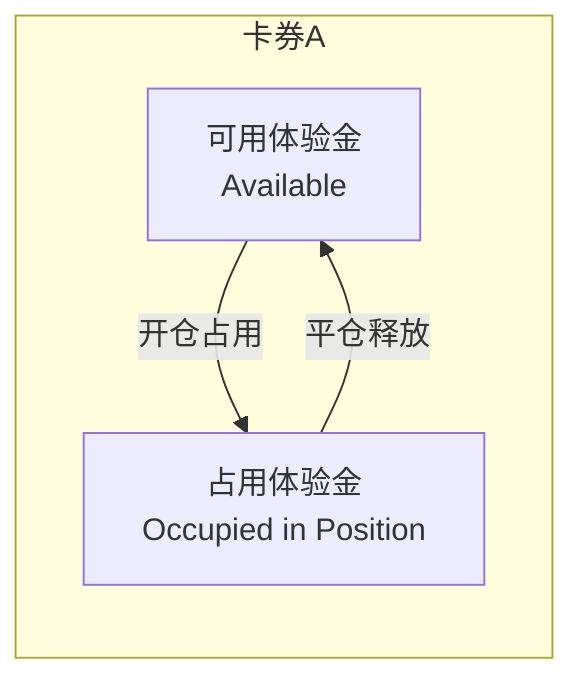
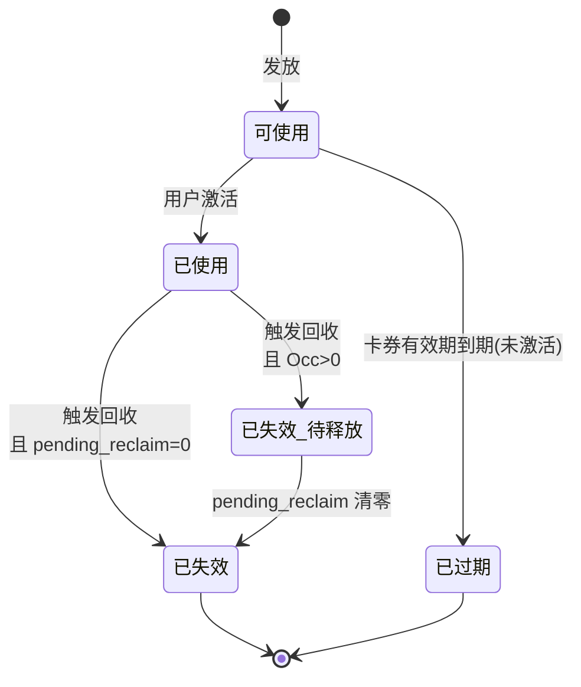
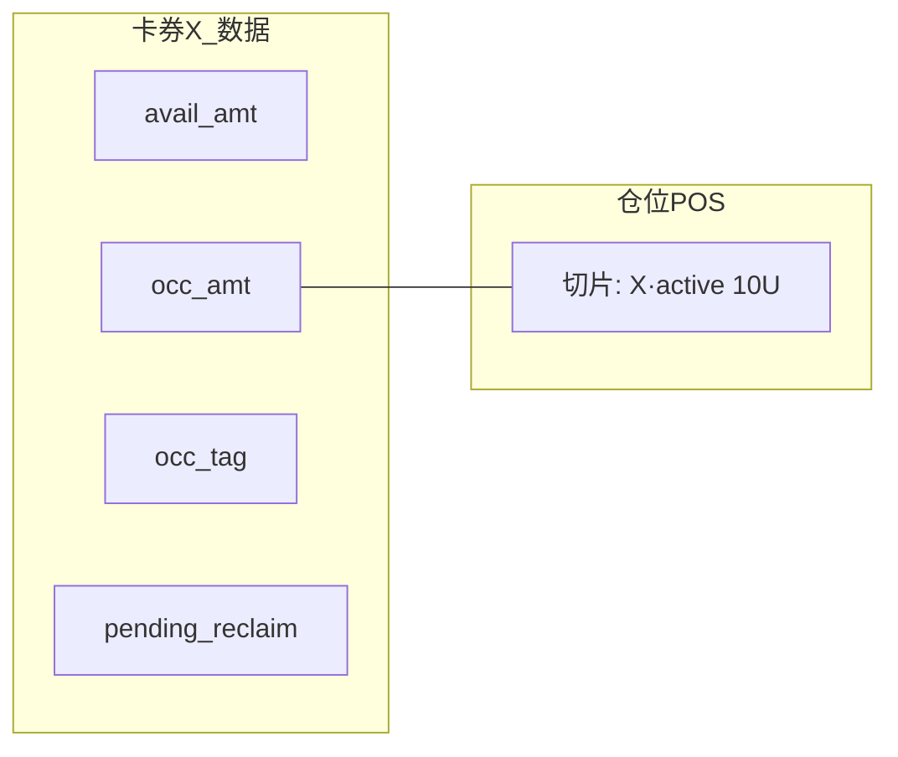
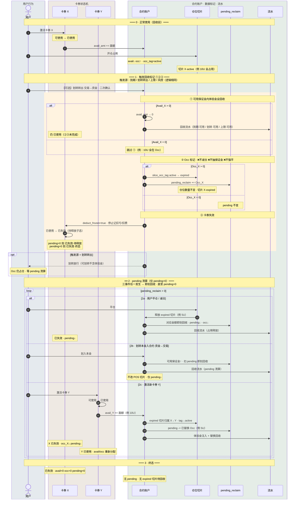
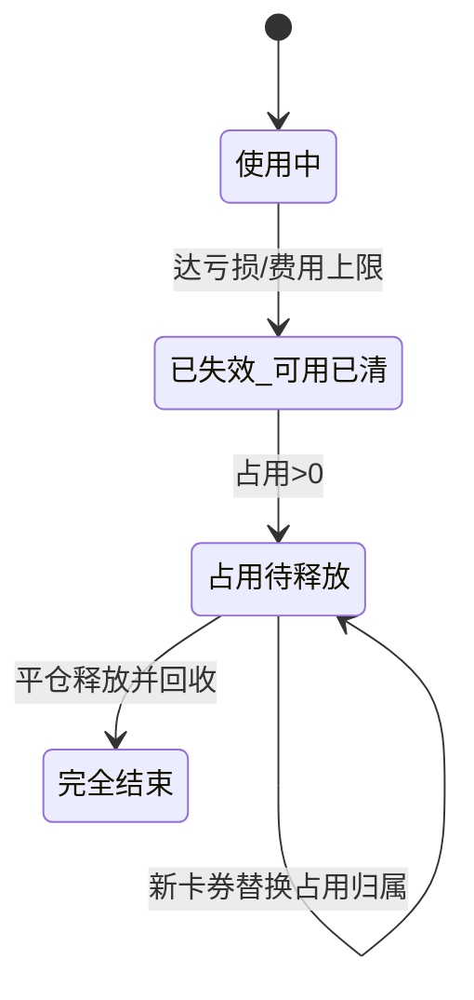
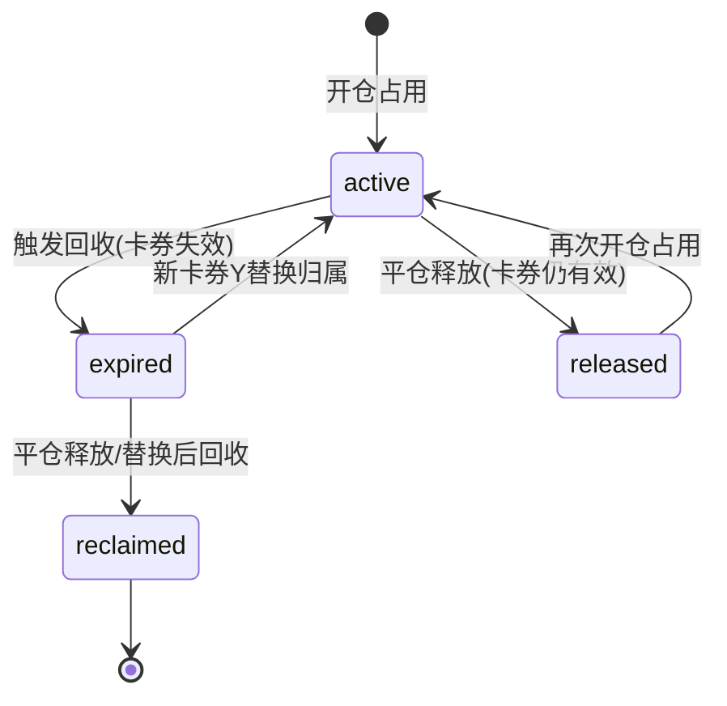

# 体验金回收机制改版方案（v2）

> **状态**：方案讨论稿 · 替代原《[合约体验金&卡券中心页](合约体验金&卡券中心页（后台_Web_APP）.md)》§6 中「减仓 / 抽离仓位保证金」回收路径  
> **唯一主图**：`perp_dex/流程图/体验金回收机制v2.mmd`（时序图，内含原流程图 ①②③ 与 pending 三分支）

**术语（避免和「划转」混淆）：**

| 术语 | 方向 | 在 v2 里的角色 |
|------|------|----------------|
| **划转转出** | 交易账户 → 资金账户 | **触发回收标记**（与到期同级）：可用全回收 + Occ 标 expired |
| **划转本金入合约** | 资金账户 → 交易账户 | **pending 清算事件**：有可用保证金时对 pending **即刻回收** |
| **平仓** | 平/减仓 | pending 清算事件 |
| **激活新卡券** | 卡券中心 | pending 清算 + 替换 Occ 归属 |

---

## 1. 改版背景

### 1.1 原逻辑（v1）的问题

v1 在触发回收（到期、划转、亏损/费用上限、风控）时，若体验金被持仓占用且可用余额不足，会：

- **从持仓保证金中直接抽走体验金**；或
- **按规则减仓**（优先减体验金占比最高的仓位）。

该路径在实际落地中**走不通**：强平/减仓副作用大、用户体验差、与风控/撮合边界耦合重。

### 1.2 v2 核心原则

| 原则 | 说明 |
|------|------|
| **不做系统平仓** | 不因体验金回收触发任何强制平仓 |
| **不抽离仓位保证金** | 不从持仓占用保证金中「暴力」扣回体验金 |
| **只回收可用保证金** | 仅回收合约账户**可用**体验金余额 |
| **占用部分标记过期** | 仍在仓位中的体验金 → 标记为**已过期占用**，待释放后再回收 |
| **卡券替换** | 用户启用新体验金时，可触发 pending 清算 + **替换**仓位中过期卡券的占用归属 |

**回收分两阶段（全文统一口径）：**

1. **触发回收标记**（到期、**划转转出**、上限、风控等）：可用体验金**全部即刻回收**；Occ 改 `expired`；卡券**已失效**；Occ 进 `pending_reclaim`。**不碰仓位。**
2. **pending 即刻清算**（仅当 pending > 0）：用户 **平仓** / **划转本金入合约** / **激活新卡券** 时，对释放或可用的部分**即刻回收**，直至 pending 清零。

---

## 2. 体验金账户模型（v2）

每张卡券在合约账户内拆为两部分：

| 字段 | 含义 |
|------|------|
| **可用体验金** | 未绑定任何持仓，可立即被回收 |
| **占用体验金** | 已作为某仓位保证金的一部分，**不可主动抽离** |
| **占用归属卡券** | 每个仓位保证金切片标记来自哪张卡券（卡券 A / 卡券 B …） |
| **过期占用** | 卡券已失效，但占用切片仍留在仓位中，仅等待释放 |

**总体验金展示** = 各卡券（可用 + 占用）之和；**可回收金额** = 各卡券可用部分之和（不含过期占用，过期占用待平仓释放）。

### 2.1 双层状态模型

v2 回收逻辑需同时维护 **卡券状态机（用户可见）** 与 **数据标记（系统底层）**，二者不一一等同。

#### 卡券状态机（4 + 1 子态）

| 卡券状态 | 用户可见含义 | 是否还可激活/使用 |
|----------|--------------|-------------------|
| **可使用** | 在卡券中心待激活 | 可激活 |
| **已使用** | 已注入合约账户 | 可开仓占用 |
| **已过期** | 未激活即过期 | 否 |
| **已失效** | 已触发回收 | 否 |
| **已失效 · 待释放**（子态） | 已失效但持仓中仍有本券过期占用 | 否；等平仓/新券 |

> **已失效 · 待释放**：对外仍展示「已失效」，后台 `pending_reclaim > 0` 标识占用未清。

#### 数据标记（每张卡券 + 仓位切片）

| 字段 | 类型 | 说明 |
|------|------|------|
| `avail_amt` | 金额 | 可用体验金，**可立即回收** |
| `occ_amt` | 金额 | 占用体验金，挂在仓位保证金切片上 |
| `occ_tag` | 枚举 | `none` / `active` / `expired` |
| `pending_reclaim` | 金额 | 已失效但仍占用、待释放后扣回的金额 |
| `loss_used` / `fee_used` | 金额 | 累计扣亏 / 扣费（上限统计用） |
| `deduct_frozen` | bool | 失效后为 true，禁止继续向该券记扣 |

**仓位保证金切片**（每条持仓记录）：

| 字段 | 说明 |
|------|------|
| `slice_coupon_id` | 归属卡券 ID |
| `slice_amt` | 该切片金额 |
| `slice_occ_tag` | `active` / `expired` |

### 2.2 动作 → 状态对照速查

| 动作 | 卡券状态 | avail | occ | occ_tag | pending_reclaim | 流水 |
|------|----------|-------|-----|---------|-----------------|------|
| 激活 | 可使用→**已使用** | ↑面额 | 0 | none | 0 | 体验金注入 |
| 开仓占用 | 已使用 | ↓ | ↑ | **active** | 0 | — |
| **触发回收** ① | 已使用 | →0(若有) | 不变 | **expired** | +=occ | 回收(可用) |
| **触发回收** ③ | →**已失效** | 0 | 不变 | expired | >0? | — |
| 平仓释放 | 已失效 | 0 | ↓ | expired→清 | ↓即刻回收 | 回收(占用释放) |
| **划转转出** | →**已失效** | **Avail 全→0** | 不变→expired | expired | +=Occ | 回收(划转·可用) |
| 划转本金入合约 | 已失效 | — | 不变 | expired | ↓(有可用则扣) | 回收(pending 清算) |
| 激活新券 Y 替换 | X 已失效；Y **已使用** | Y↑ | X↓ Y↑ | X expired→Y **active** | X↓ | 注入+替换 |
| pending=0 | **已失效**终态 | 0 | 0 | none | 0 | — |

---

## 3. 完整时序图（唯一主图 · v2 全流程）

> 源文件：`perp_dex/流程图/体验金回收机制v2.mmd`  
> 本图**同时承载**：用户行为、卡券状态机、数据字段（avail/occ/pending/occ_tag）、流水，以及原流程图中的 **alt 分支**（Avail>0?、Occ>0?、pending 清算三分支、划转转出 opt）。

### 3.1 阶段对照表（读图索引）

| 阶段 | 对应图段 | 用户/系统行为 | 卡券状态 | 关键数据 | 流水 |
|------|----------|---------------|----------|----------|------|
| **0** | 图首 | 激活 + 开仓 | 已使用 | occ_tag=active | 注入 |
| **1·①** | rect 内 alt | 触发回收 | 仍已使用→已失效 | Avail→0（若有） | 回收(可用) |
| **1·②** | rect 内 alt | — | 仍已使用→已失效 | tag→expired, pending+=Occ | — |
| **1·③** | rect 内 | — | **已失效** | deduct_frozen | — |
| **1·opt** | opt 块 | **划转转出**确认后 | 已失效·待释放 | 同上 + 放行划转 | 划转回收 |
| **2a** | loop alt | 平仓 | 已失效 | Occ↓ pending↓ | 占用释放 |
| **2b** | loop alt | 本金划入 | 已失效 | pending↓ | pending 清算 |
| **2c** | loop alt | 激活新券 Y | X 失效；Y 已使用 | Occ 归属替换 | 注入+替换 |
| **3** | 图尾 | pending=0 | 已失效·终态 | 全零 | — |

### 3.2 触发类型（映射到 §3 图段）

**A. 触发回收标记** → 进入 **阶段 1**（①②③ 相同，与到期一致）

| 触发 | 图内体现 |
|------|----------|
| 开仓有效期到期 | 阶段 1 rect |
| 划转转出 | 阶段 1 rect + **opt 放行划转** |
| 亏损/费用上限 | 阶段 1 rect（软失效，见 §7） |
| 风控回收 | 阶段 1 rect（仍不碰 Occ 抽离） |

**B. pending 清算** → 进入 **阶段 2 loop**（三选一，可多次直至 pending=0）

| 行为 | 图内分支 |
|------|----------|
| 平仓 / 减仓 | **2a** |
| 划转本金入合约 | **2b** |
| 激活新卡券 | **2c** |

---

## 4. 回收规则摘要

**硬性约束：** 全程 **不减仓、不强平、不抽占用保证金**。

**两阶段：**

1. **触发回收标记**（§3 阶段 1）：Avail 全回收 → Occ 标 expired → 卡券已失效 → pending+=Occ  
2. **pending 清算**（§3 阶段 2）：平仓 / 本金划入 / 新卡券 → 即刻回收直至 pending=0  

**划转转出**：走阶段 1 + opt 放行；**不是** pending 清算事件。

---

### 5.1 过期回收 · 情况 A（用户举例）

**初始：**

- 卡券 A 面额 **10 U**，用户自有资金 **50 U**
- 开仓后账户保证金 **55 U**（自有 50 + 体验金 10 全部占用）
- 开仓有效期到期 → 触发回收

**到期瞬间：**

| 项目 | 处理 |
|------|------|
| 可用体验金 | **0** → 无可用可扣 |
| 占用体验金 10 U | **不抽离**；标记为「卡券 A · 已过期占用」 |
| 卡券 A 状态 | **已失效** |
| 仓位 | **不变**，仍显示 55 U 保证金 |

**用户后续平仓（举例释放后账户可用保证金含原过期占用 5 U）：**

- 若平仓释放后，待回收的过期占用 **≤ 当前可回收可用**，则**立即回收**该部分（如 5 U）。
- 若账户仍显示与过期占用相关的可释放切片，按标记逐笔回收至 0。

> 用户原话：「账户保证金 < 5 直接回收」—— v2 口径：**平仓释放出来的、仍标记为卡券 A 过期占用的保证金**，进入可用后**即刻回收**，不要求也不允许为回收而改仓位。

### 5.2 新卡券 B 替换过期占用（用户举例）

**对应 §3：阶段 2c**

**背景：** 卡券 A 已失效，仓位中仍有 **5 U** 标记为「A · 已过期占用」。

**用户激活卡券 B（面额 10 U）后：**

1. 卡券 B **10 U** 注入合约账户（`avail_Y↑`）。
2. 仓位 **5 U** 过期切片：归属 A·expired → **B·active**（`pending↓`，不增减仓）。
3. 用户净效果：B 支撑仓位 **5 U**，另 **5 U** 为 B 的可用体验金。

### 5.3 划转转出触发（v2）

**对应 §3：阶段 1 rect + opt 放行划转**

用户发起 **交易账户 → 资金账户** 划转时，对**每一张**仍有效的体验金卡券执行 **§3 阶段 1**（①②③）：

| 步骤 | 行为 |
|------|------|
| 1 | 弹窗二次确认：可用体验金将全部回收；占用部分**不会**减仓或抽保证金 |
| 2 | **可用保证金内的体验金：全部即刻回收**，写「划转回收」流水 |
| 3 | **不足部分**（Occ 仍在仓位）：`occ_tag→expired`，`pending_reclaim+=Occ`，卡券**已失效** |
| 4 | 划转按原规则放行（不含体验金、不含未实现盈利） |
| 5 | pending 清零：**§3 阶段 2** 平仓 / 本金划入 / 新卡券 |

---

## 6. 与扣费 / 扣亏的关系（v2 不变部分）

以下规则**仍可保留**，与 v1 一致：

- 费用、亏损 **优先扣自有资金**，不足再扣体验金。
- 每张卡券独立累计 **已实现 + 未实现** 亏损消耗、**累计费用**消耗。
- 多张卡券按开仓有效期优先抵扣。

**变化点**：达上限后的动作由「强制回收全部含占用」改为「回收可用 + 占用标记失效 + 停止向该卡券继续记扣」（见 §7）。

---

## 7. 亏损抵扣上限 & 费用抵扣上限 · 评估

### 7.1 结论（直接回答）

> **你的理解基本正确：v2 下，「亏损抵扣上限 / 费用抵扣上限」无法再像 v1 一样起到「立即封顶并清空全部体验金（含占用）」的硬限制效果。**

但可以拆成两层看：

| 能力 | v1 | v2 |
|------|----|----|
| **限制后续继续用该卡券扣亏/扣费** | ✅ 回收后停止 | ✅ 卡券失效后停止向该卡券记账 |
| **立即收回可用体验金** | ✅ | ✅ |
| **立即收回占用体验金** | ✅ 减仓/抽保证金 | ❌ **做不到** |
| **限制未实现亏损场景下的总敞口** | ✅ 可强制减仓 | ❌ **显著减弱** |
| **占用中「残值」体验金** | 可清掉 | 只能等平仓/替换 |

### 7.2 为什么「硬上限」弱化了

**亏损上限**原公式：

> （已实现盈亏消耗 + 未实现盈亏消耗）/ 面额 ≥ X% → 强制回收

- **已实现部分**：随平仓自然扣减体验金，上限仍可统计。
- **未实现部分**：价格不利时，占用保证金中的体验金**仍在仓位里承担风险**。
- v1 到点可减仓把占用也清掉；v2 到点只能：
  - 回收可用；
  - 标记占用失效；
  - **仓位仍带着过期占用直到用户平仓**。

因此：**平台在「占用中过期体验金」上的风险暴露窗口被拉长**，上限无法即时闭合。

**费用上限**同理：

- 已累计费用达 X% 后，可停止该卡券继续承担新费用（改扣自有或拒绝）。
- 但**无法立即收回**已作为保证金的体验金；资金费继续运行期间，占用切片仍留在仓位。

### 7.3 若仍要保留上限开关，v2 建议语义

将「上限触发回收」改为「**上限触发失效**」：

| 动作 | 说明 |
|------|------|
| 达上限瞬间 | 回收可用 + 卡券失效 + **禁止该卡券继续记扣亏/扣费** |
| 占用部分 | 标记过期占用，**不减仓** |
| 用户感知 | 文案改为「该卡券已达亏损/费用上限，已失效；持仓中 X U 将在平仓后回收」 |

### 7.4 产品选型建议

| 选项 | 说明 |
|------|------|
| **A. 保留上限（软限制）** | 仅限制继续消耗与可用回收；接受占用延迟释放风险 |
| **B. 去掉上限** | 与 v2 哲学一致，简化规则；靠面额 + 有效期 + 风控回收控风险 |
| **C. 仅保留「已实现」口径上限** | 去掉未实现盈亏计入上限，避免到点无法执行的尴尬 |
| **D. 仅费用上限、去掉亏损上限** | 费用可完全已实现累计；亏损上限与占用风险绑定过紧 |

**推荐**：短期 **B 或 C**；若合规必须保留上限，采用 **A + 改文案**，并在后台披露「占用中过期体验金」监控指标。

---

## 8. 状态与流水（v2 增量）

### 8.1 卡券状态 × 数据字段矩阵

| 卡券状态 | avail_amt | occ_amt | occ_tag | pending_reclaim | deduct_frozen |
|----------|-----------|---------|---------|-----------------|---------------|
| 可使用 | 0（未注入） | 0 | none | 0 | false |
| 已使用 | ≥0 | ≥0 | active / none | 0 | false |
| 已失效 · 待释放 | 0 | >0 | **expired** | = occ（待清） | **true** |
| 已失效 · 终态 | 0 | 0 | none | 0 | true |
| 已过期 | 0 | 0 | none | 0 | — |

### 8.2 占用切片状态机

| occ_tag | 含义 | 可否被回收引擎直接扣减 |
|---------|------|------------------------|
| `active` | 正常占用 | 否（仅 avail 可扣） |
| `expired` | 卡券已失效仍占仓 | 否；释放或替换后才回收 |

### 8.3 回收流水类型

| 场景 | 合约字段（建议） |
|------|------------------|
| 到期 · 仅回收可用 | 到期回收（可用） |
| **划转转出 · 回收可用** | **划转回收** |
| 平仓释放 · 回收过期占用 | 占用释放回收 |
| 划转本金入合约 · pending 清算 | pending 清算回收 |
| 新卡券 · 替换 Occ 归属 | 替换回收 |
| 达上限 · 仅回收可用 | 亏损/费用上限失效 |

### 8.4 关联原型文件

| 文件 | 内容 |
|------|------|
| `perp_dex/流程图/体验金回收机制v2.mmd` | **唯一主图** · v2 完整时序（含流程分支） |

---

## 9. 待确认问题

- [x] 划转：**划转转出** = 触发回收标记（可用全回收 + Occ 进 pending）；**划转本金入合约** = pending 清算事件
- [ ] 划转转出：是否对**所有**已使用卡券批量执行 ①②③（含尚未到期的卡）？
- [ ] 新卡券替换：替换占用归属时，是否要求新卡券可用 ≥ 过期占用额？
- [ ] 风控回收：是否同样遵守「不碰仓位」？若合规要求立刻清零，是否仅做「禁止开仓 + 标记失效」？
- [ ] 亏损/费用上限：**保留软限制 vs 下线**，需产品 / 风控拍板。
- [ ] 用户文案：持仓中过期占用是否需要在仓位详情展示「其中 X U 为已失效体验金」？

---

## 10. 与主文档关系

| 文档 | 关系 |
|------|------|
| 《[合约体验金&卡券中心页（后台_Web_APP）](合约体验金&卡券中心页（后台_Web_APP）.md)》§6 | 本方案确认后，替换 §6.2–§6.4 及上限触发后的执行路径 |
| `perp_dex/流程图/回收执行流程.mmd` | v1 旧版（待废弃） |
| `perp_dex/流程图/体验金回收机制v2.mmd` | **v2 唯一主图**（时序 · 含全流程逻辑） |
