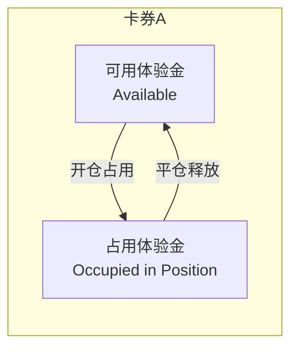
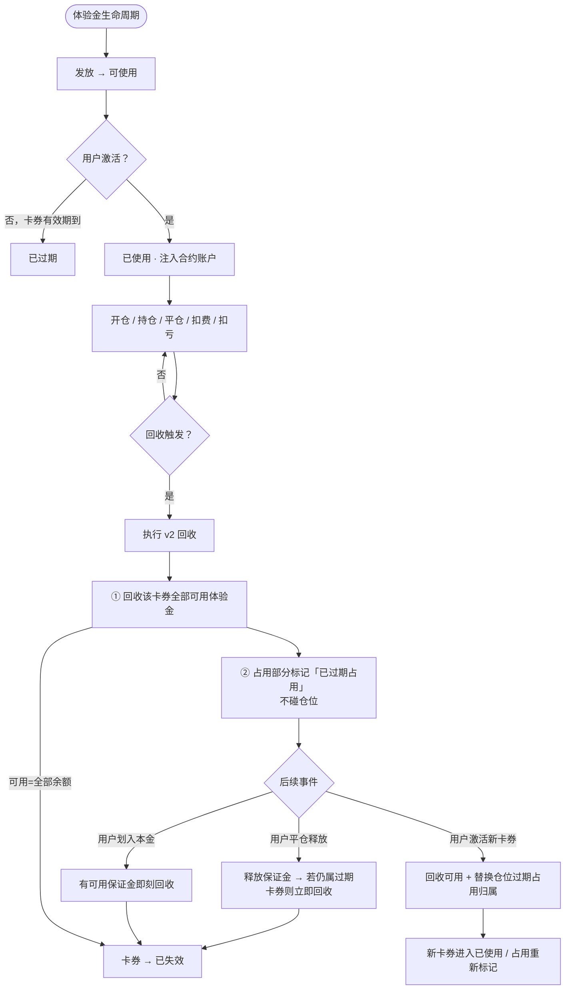
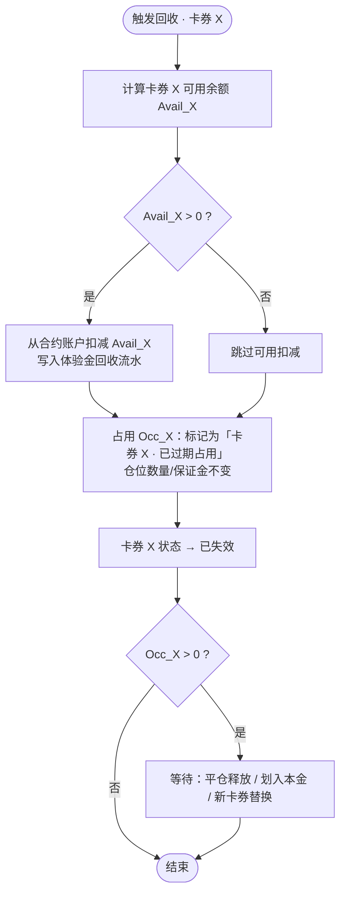
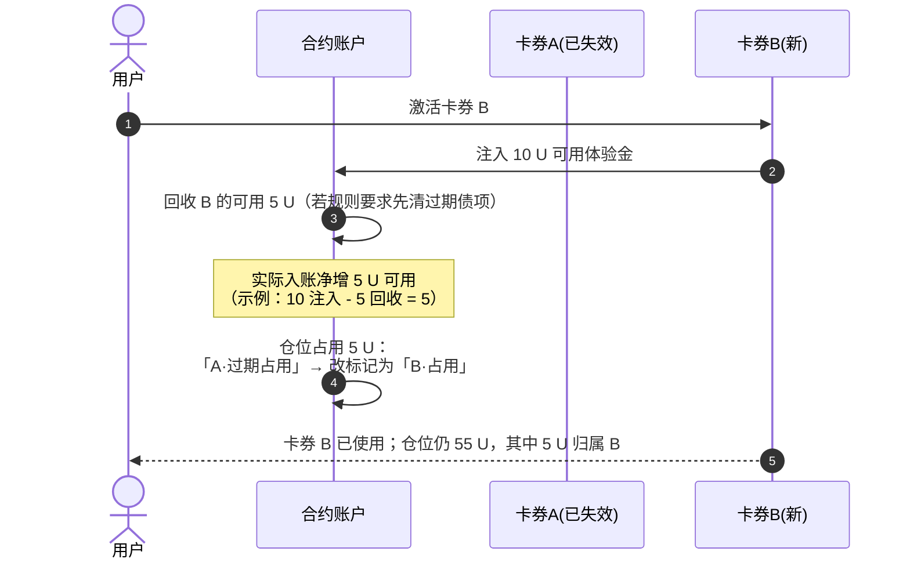
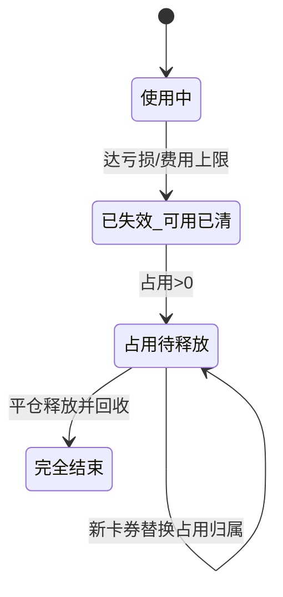

# 体验金回收机制改版方案（v2）

> **状态**：方案讨论稿 · 替代原《[合约体验金&卡券中心页](合约体验金&卡券中心页（后台_Web_APP）.md)》§6 中「减仓 / 抽离仓位保证金」回收路径  
> **关联原型**：`perp_dex/流程图/体验金回收机制v2.mmd`

---

## 1. 改版背景

### 1.1 原逻辑（v1）的问题

v1 在触发回收（到期、划转、亏损/费用上限、风控）时，若体验金被持仓占用且可用余额不足，会：

- **从持仓保证金中直接抽走体验金**；或
- **按规则减仓**（优先减体验金占比最高的仓位）。

该路径在实际落地中**走不通**：强平/减仓副作用大、用户体验差、与风控/撮合边界耦合重。

### 1.2 v2 核心原则

| 原则 | 说明 |
|------|------|
| **不做系统平仓** | 不因体验金回收触发任何强制平仓 |
| **不抽离仓位保证金** | 不从持仓占用保证金中「暴力」扣回体验金 |
| **只回收可用保证金** | 仅回收合约账户**可用**体验金余额 |
| **占用部分标记过期** | 仍在仓位中的体验金 → 标记为**已过期占用**，待释放后再回收 |
| **卡券替换** | 用户启用新体验金时，可触发可用回收 + **替换**仓位中过期卡券的占用归属 |

---

## 2. 体验金账户模型（v2）

每张卡券在合约账户内拆为两部分：

| 字段 | 含义 |
|------|------|
| **可用体验金** | 未绑定任何持仓，可立即被回收 |
| **占用体验金** | 已作为某仓位保证金的一部分，**不可主动抽离** |
| **占用归属卡券** | 每个仓位保证金切片标记来自哪张卡券（卡券 A / 卡券 B …） |
| **过期占用** | 卡券已失效，但占用切片仍留在仓位中，仅等待释放 |

**总体验金展示** = 各卡券（可用 + 占用）之和；**可回收金额** = 各卡券可用部分之和（不含过期占用，过期占用待平仓释放）。

---

## 3. 全流程图（v2）

---

## 4. 回收触发与执行（v2）

### 4.1 触发类型一览

| 触发场景 | v1 行为 | v2 行为 |
|----------|---------|---------|
| 开仓有效期到期 | 强制回收含占用；不足则减仓/抽保证金 | 只回收可用；占用标记过期 |
| 划转（交易→资金） | 强制回收含占用 | 先回收可用；占用标记过期；划转放行（占用仍留仓） |
| 亏损抵扣达上限 | 强制回收剩余全部 | 见 §7 评估 |
| 费用抵扣达上限 | 强制回收剩余全部 | 见 §7 评估 |
| 风控回收 | 强制回收含占用 | **待定**：运营是否仍要求「标记失效 + 回收可用」；仍不抽保证金 |
| 用户平仓 | 释放保证金；过期卡券部分立即回收 | **同左** |
| 用户划入本金 | — | **新增**：有可用保证金时即刻回收待回收项 |
| 用户激活新卡券 | — | **新增**：回收可用 + 替换仓位过期占用卡券归属 |

### 4.2 统一回收执行流程

**硬性约束（v2）：**

- 流程中**不得**出现：减仓、强平、修改仓位数量、从占用保证金直接扣款。

---

## 5. 场景示例

### 5.1 过期回收 · 情况 A（用户举例）

**初始：**

- 卡券 A 面额 **10 U**，用户自有资金 **50 U**
- 开仓后账户保证金 **55 U**（自有 50 + 体验金 10 全部占用）
- 开仓有效期到期 → 触发回收

**到期瞬间：**

| 项目 | 处理 |
|------|------|
| 可用体验金 | **0** → 无可用可扣 |
| 占用体验金 10 U | **不抽离**；标记为「卡券 A · 已过期占用」 |
| 卡券 A 状态 | **已失效** |
| 仓位 | **不变**，仍显示 55 U 保证金 |

**用户后续平仓（举例释放后账户可用保证金含原过期占用 5 U）：**

- 若平仓释放后，待回收的过期占用 **≤ 当前可回收可用**，则**立即回收**该部分（如 5 U）。
- 若账户仍显示与过期占用相关的可释放切片，按标记逐笔回收至 0。

> 用户原话：「账户保证金 < 5 直接回收」—— v2 口径：**平仓释放出来的、仍标记为卡券 A 过期占用的保证金**，进入可用后**即刻回收**，不要求也不允许为回收而改仓位。

### 5.2 新卡券 B 替换过期占用（用户举例）

**背景：** 卡券 A 已失效，仓位中仍有 **5 U** 标记为「A · 已过期占用」。

**用户激活卡券 B（面额 10 U）：**

**步骤拆解（与举例对齐）：**

1. 卡券 B **10 U** 进入合约账户（可用）。
2. 触发回收逻辑：对**已可回收的过期占用释放额**（如 **5 U**）执行回收。
3. 仓位中原 **5 U 过期占用** 的标记从卡券 A **替换为卡券 B 占用**（不增减仓）。
4. 用户净效果：新卡券 B 实际支撑仓位 **5 U**，另 **5 U** 仍为可用体验金（10 - 5 替换占用）。

### 5.3 划转触发（v2）

用户发起交易账户 → 资金账户划转：

1. 弹窗提示：将回收**全部可用**体验金；**持仓中过期/未过期占用不受影响**。
2. 执行：回收各卡券可用余额；已失效卡券的占用继续标记等待平仓。
3. 划转按现有「可划转金额」规则放行（不含体验金、不含未实现盈利）。

---

## 6. 与扣费 / 扣亏的关系（v2 不变部分）

以下规则**仍可保留**，与 v1 一致：

- 费用、亏损 **优先扣自有资金**，不足再扣体验金。
- 每张卡券独立累计 **已实现 + 未实现** 亏损消耗、**累计费用**消耗。
- 多张卡券按开仓有效期优先抵扣。

**变化点**：达上限后的动作由「强制回收全部含占用」改为「回收可用 + 占用标记失效 + 停止向该卡券继续记扣」（见 §7）。

---

## 7. 亏损抵扣上限 & 费用抵扣上限 · 评估

### 7.1 结论（直接回答）

> **你的理解基本正确：v2 下，「亏损抵扣上限 / 费用抵扣上限」无法再像 v1 一样起到「立即封顶并清空全部体验金（含占用）」的硬限制效果。**

但可以拆成两层看：

| 能力 | v1 | v2 |
|------|----|----|
| **限制后续继续用该卡券扣亏/扣费** | ✅ 回收后停止 | ✅ 卡券失效后停止向该卡券记账 |
| **立即收回可用体验金** | ✅ | ✅ |
| **立即收回占用体验金** | ✅ 减仓/抽保证金 | ❌ **做不到** |
| **限制未实现亏损场景下的总敞口** | ✅ 可强制减仓 | ❌ **显著减弱** |
| **占用中「残值」体验金** | 可清掉 | 只能等平仓/替换 |

### 7.2 为什么「硬上限」弱化了

**亏损上限**原公式：

> （已实现盈亏消耗 + 未实现盈亏消耗）/ 面额 ≥ X% → 强制回收

- **已实现部分**：随平仓自然扣减体验金，上限仍可统计。
- **未实现部分**：价格不利时，占用保证金中的体验金**仍在仓位里承担风险**。
- v1 到点可减仓把占用也清掉；v2 到点只能：
  - 回收可用；
  - 标记占用失效；
  - **仓位仍带着过期占用直到用户平仓**。

因此：**平台在「占用中过期体验金」上的风险暴露窗口被拉长**，上限无法即时闭合。

**费用上限**同理：

- 已累计费用达 X% 后，可停止该卡券继续承担新费用（改扣自有或拒绝）。
- 但**无法立即收回**已作为保证金的体验金；资金费继续运行期间，占用切片仍留在仓位。

### 7.3 若仍要保留上限开关，v2 建议语义

将「上限触发回收」改为「**上限触发失效**」：

| 动作 | 说明 |
|------|------|
| 达上限瞬间 | 回收可用 + 卡券失效 + **禁止该卡券继续记扣亏/扣费** |
| 占用部分 | 标记过期占用，**不减仓** |
| 用户感知 | 文案改为「该卡券已达亏损/费用上限，已失效；持仓中 X U 将在平仓后回收」 |

### 7.4 产品选型建议

| 选项 | 说明 |
|------|------|
| **A. 保留上限（软限制）** | 仅限制继续消耗与可用回收；接受占用延迟释放风险 |
| **B. 去掉上限** | 与 v2 哲学一致，简化规则；靠面额 + 有效期 + 风控回收控风险 |
| **C. 仅保留「已实现」口径上限** | 去掉未实现盈亏计入上限，避免到点无法执行的尴尬 |
| **D. 仅费用上限、去掉亏损上限** | 费用可完全已实现累计；亏损上限与占用风险绑定过紧 |

**推荐**：短期 **B 或 C**；若合规必须保留上限，采用 **A + 改文案**，并在后台披露「占用中过期体验金」监控指标。

---

## 8. 状态与流水（v2 增量）

### 8.1 卡券状态（补充）

| 状态 | v2 补充说明 |
|------|-------------|
| **已失效** | 可用已回收；可能存在「过期占用 > 0」待释放 |
| 占用切片 | 新增子状态：`active_occupied` / `expired_occupied` |

### 8.2 回收流水类型（增量）

| 场景 | 合约字段（建议） |
|------|------------------|
| 到期 · 仅回收可用 | 到期回收（可用） |
| 平仓释放 · 回收过期占用 | 到期回收（占用释放） |
| 新卡券 · 替换占用前回收 | 替换回收 |
| 达上限 · 仅回收可用 | 亏损上限失效 / 费用上限失效 |

---

## 9. 待确认问题

- [ ] 划转时：是否仍要求「回收全部可用体验金后卡券一律已失效」，即使有多张卡券？
- [ ] 新卡券替换：替换占用归属时，是否要求新卡券可用 ≥ 过期占用额？
- [ ] 风控回收：是否同样遵守「不碰仓位」？若合规要求立刻清零，是否仅做「禁止开仓 + 标记失效」？
- [ ] 亏损/费用上限：**保留软限制 vs 下线**，需产品 / 风控拍板。
- [ ] 用户文案：持仓中过期占用是否需要在仓位详情展示「其中 X U 为已失效体验金」？

---

## 10. 与主文档关系

| 文档 | 关系 |
|------|------|
| 《[合约体验金&卡券中心页（后台_Web_APP）](合约体验金&卡券中心页（后台_Web_APP）.md)》§6 | 本方案确认后，替换 §6.2–§6.4 及上限触发后的执行路径 |
| `perp_dex/流程图/回收执行流程.mmd` | 待本方案定稿后更新为 v2 或新建 v2 文件 |
